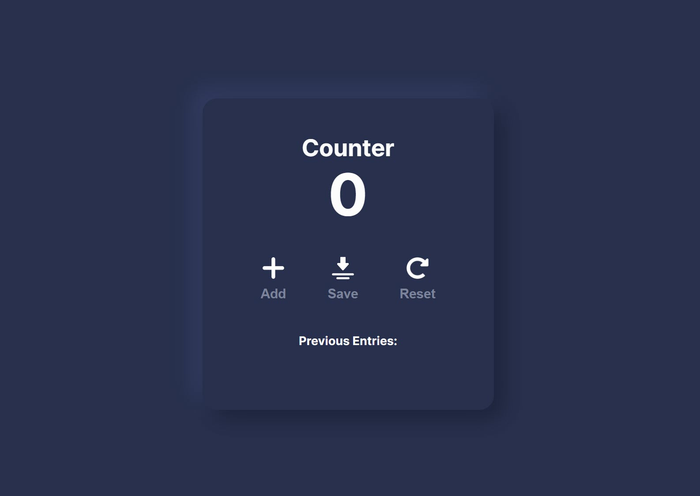

# Counter JavaScript Project

This project is a simple counter application built with JavaScript. It allows users to increment a count, save the current count, and reset the count to zero. It also saves any previous entries with no limitations.

## Features

- **Increment**: The `increment` function increases the count by one each time it's called. The updated count is then displayed on the screen.
- **Save**: The `save` function saves the current count by appending it to a list of saved counts. It then resets the count to zero.
- **Reset**: The `reset` function sets the count back to zero and updates the display accordingly.
- And a "Previous Entries" section showing the last enter numbers.

